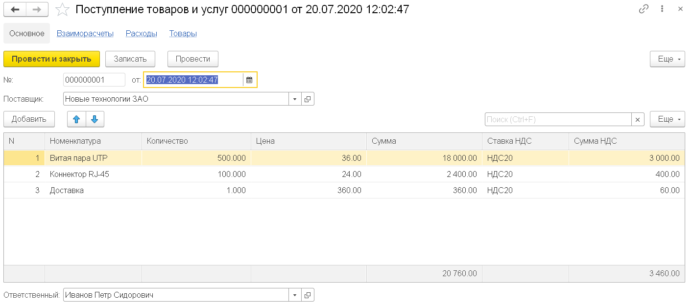

### Сделки

Все добавляемые объекты включаем в новую подсистему **Сделки**

1. Добавить регистр накопления **Товары** вида "Остатки":
  * Добавить измерение Номенклатура (СправочникСсылка.Номенклатура) и ресурсы Сумма (ОпределяемыйТип.Сумма) и Количество (ОпределяемыйТип.Количество)

2. Добавить регистр накопления **Взаиморасчеты** вида "Остатки":
  * Добавить измерение Контрагент (СправочникСсылка.Контрагенты) и ресурс Сумма (ОпределяемыйТип.Сумма)

3. Добавить регистр накопления **Доходы** вида "Обороты":
  * Добавить измерение Номенклатура (СправочникСсылка.Номенклатура) и ресурсы Сумма (ОпределяемыйТип.Сумма) и Количество (ОпределяемыйТип.Количество)

4. Добавить регистр накопления **Расходы** вида "Обороты":
  * Добавить измерение Номенклатура (СправочникСсылка.Номенклатура) и ресурс Сумма (ОпределяемыйТип.Сумма)
  
5. Добавить общий модуль НДСКлиентСервер:
 * С флагами "Клиент" и "Сервер"
 * Создать в нем функцию СуммаНДСПоСтавке(Сумма, СтавкаНДС), возвращающую сумму НДС, рассчитанную от суммы по ставке согласно [требованиям](diploma-b-reqs.md). Чтобы обеспечить работоспособность на клиенте, для получения значений ставок НДС используйте функцию ПредопределенноеЗначение().
  
6. Добавить документ **ПоступлениеТоваровИУслуг**:
  * Добавить реквизиты Поставщик (СправочникСсылка.Контрагенты) и Сумма (ОпределяемыйТип.Сумма)
  * Добавить ТЧ ТоварыИУслуги с реквизитами:
    * Номенклатура (СправочникСсылка.Номенклатура)
    * Количество (ОпределяемыйТип.Количество)
    * СтавкаНДС (ПеречислениеСсылка.СтавкиНДС)
    * Цена, Сумма, СуммаНДС (ОпределяемыйТип.Сумма)
  * В "Движениях" выбрать регистры накопления Товары, Расходы и Взаиморасчеты
  * Создать форму документа, в которой:
    * Разумным образом разместить элементы управления для реквизитов и табличных частей
     * В таблице товаров и услуг включить отображение подвала и вывести в него итог по колонкам "Сумма" и "Сумма НДС", поставив флаг "Отображать в подвале" и задав путь к данным подвала.
    * Создать клиентские процедуры:
      * ПриИзмененииКоличества(ИзмененнаяСтрока), ПриИзмененииЦены(ИзмененнаяСтрока), в которых:
        * Рассчитывать сумму по цене и количеству и вызывать ПриИзмененииСуммы
      * ПриИзмененииСуммы(ИзмененнаяСтрока), ПриИзмененииСтавкиНДС(ИзмененнаяСтрока), в которых:
        * Рассчитывать сумму НДС по сумме и ставке
    * Переопределить обработчики событий ПриИзменении полей ввода для количества, цены, суммы и ставки НДС, и вызывать из них процедуры ПриИзменении<...>, передавая в качестве параметра ТекущиеДанные таблицы.
  * Форма может выглядеть, например, так:

  * В модуле объекта:
    * Создать обработчик события ОбработкаПроведения и формировать движения (выбрав предварительно запросом табличную часть с типами номенклатуры):
      * По регистру Взаиморасчеты - одно движение вида "Расход" с указанием контрагента-поставщика и общей суммы
      * По регистру Товары - движения вида "Приход" по каждой строке с номенклатурой типа Товары с указанием номенклатуры, количества и суммы
      * По регистру Расходы - движения по каждой строке с номенклатурой типа Услуги с указанием номенклатуры и суммы
    * Создать обработчик события ПередЗаписью и сохранять в реквизит шапки Сумма итог по одноименному реквизиту табличной части для отображения в списках
 * Проверить документ, убедившись в том, что:
  * При изменении количества и цены пересчитывается сумма и сумма НДС, а при изменении суммы и ставки НДС - сумма НДС
  * Формируются движения по трем регистрам накопления, и сумма движения по Взаиморасчетам равна итогу по колонке Сумма и сумме движений по Товарам и Расходам. Пример движений для документа со снимка выше:

7. Добавить документ **РеализацияТоваровИУслуг** (или скопировать и переименовать **ПоступлениеТоваровИУслуг**):
  * Добавить реквизиты Покупатель (СправочникСсылка.Контрагенты) и Сумма (ОпределяемыйТип.Сумма)
  * Добавить ТЧ ТоварыИУслуги с реквизитами:
    * Номенклатура (СправочникСсылка.Номенклатура)
    * Количество (ОпределяемыйТип.Количество)
    * СтавкаНДС (ПеречислениеСсылка.СтавкиНДС)
    * Скидка (Число)
    * Цена, Сумма, СуммаНДС (ОпределяемыйТип.Сумма)
  * В "Движениях" выбрать регистры накопления Товары, Доходы, Расходы и Взаиморасчеты
  * Создать форму документа, в которой:
    * Разумным образом разместить элементы управления для реквизитов и табличных частей
     * В таблице товаров и услуг включить отображение подвала и вывести в него итог по колонкам "Сумма" и "Сумма НДС".
    * Создать клиентские процедуры:
      * ПриИзмененииНоменклатуры(ИзмененнаяСтрока), в которой:
        * Заполнять цену и скидку аналогично документам **УстановкаЦен** и **УстановкаСкидок** и вызывать процедуры ПриИзмененииЦены и ПриИзмененииСкидки
      * ПриИзмененииКоличества(ИзмененнаяСтрока), ПриИзмененииЦены(ИзмененнаяСтрока), ПриИзмененииСкидки(ИзмененнаяСтрока), в которых:
        * Рассчитывать сумму по цене, количеству и скидке и вызывать ПриИзмененииСуммы
      * ПриИзмененииСуммы(ИзмененнаяСтрока), ПриИзмененииСтавкиНДС(ИзмененнаяСтрока), в которых:
        * Рассчитывать сумму НДС по сумме и ставке
    * Переопределить обработчики событий ПриИзменении полей ввода номенклатуры, количества, цены, скидки, суммы и ставки НДС, и вызывать из них процедуры ПриИзменении<...>, передавая в качестве параметра ТекущиеДанные таблицы.
    * Реализовать подбор аналогично документу **УстановкаЦен**, в обработчике события **ОбработкаВыбора** вызывая процедуру ПриИзмененииНоменклатуры, чтобы обеспечить получение цен и скидок и автоматический пересчет.
  * В модуле объекта:
    * Создать обработчик события ОбработкаПроведения и формировать движения:
      * По регистру Взаиморасчеты - одно движение вида "Приход" с указанием контрагента-покупателя и общей суммы
      * По регистру Товары - движения вида "Расход" по каждой строке с номенклатурой типа Товары с указанием номенклатуры, количества и суммы. Сумму рассчитывать, выбрав запросом остатки по номенклатуре в табличной части, определив среднюю стоимость единицы делением суммы на количество и умножив среднюю стоимость на реализуемое количество. При нехватке остатков отказываться от проведения, выводя пользователю разумное сообщение.
      * По регистру Расходы - движения по каждой строке с номенклатурой типа Товары с указанием номенклатуры и суммы, равной сумме расхода по регистру Товары.
      * По регистру Доходы - движения по каждой строке с указанием номенклатуры, количества и суммы
    * Создать обработчик события ПередЗаписью и сохранять в реквизит шапки Сумма итог по одноименному реквизиту табличной части для отображения в списках
 * Проверить документ, убедившись в том, что:
  * При изменении количества, цены и скидки пересчитывается сумма и сумма НДС, а при изменении суммы и ставки НДС - сумма НДС
  * Формируются движения по четырем регистрам накопления, и сумма движения по Взаиморасчетам равна итогу по колонке Сумма и сумме движений по Доходам, а суммы движений по Расходам и Товарам совпадают. Пример движений для документа со снимка выше:

8. Добавить журнал документов **Сделки**:
  * В качестве регистрируемых выбрать документы **ПоступлениеТоваровИУслуг** и **РеализацияТоваровИУслуг**
  * Добавить графы Контрагент  (Поставщик из Поступления и Покупатель из Реализации), Ответственный и Сумма
