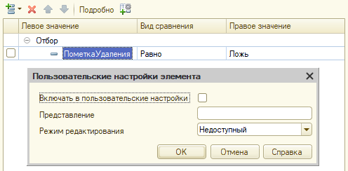

# Задание к занятию "Формы справочников"

## Задача 1 "Подбор программ в форму контрагента"

### Описание задачи
Создать в справочнике "Контрагенты" табличную часть с программами, которые контрагент-клиент использует, и реализовать подбор программ из справочника "Номенклатура" в форму контрагента.

### Требования к результату

Конфигурация из предыдущих заданий, со справочниками "Контрагенты" и "Номенклатура", в которой:
* К справочнику "Контрагенты" добавлена табличная часть "Программы" с реквизитом "Программа" типа СправочникСсылка.Номенклатура;
* В форме контрагента есть таблица "Программы" с кнопкой "Подбор" в командной панели, открывающая форму выбора справочника "Номенклатура" в режиме подбора. Результат подбора не должен содержать дублей программ.

### Процесс выполнения

* Добавить ко справочнику "Контрагенты" табличную часть "Программы".
* Добавить к табличной части индексированный реквизит "Программа" (СправочникСсылка.Номенклатура).
* Перетащить табличную часть на форму элемента, скрыв заголовок (мы выведем его отдельной декорацией). На форме появится таблица формы, содержащая программы, используемые контрагентом.
* Добавить команду "Подбор" и перетащить ее кнопкой в командную панель таблицы формы с программами. В обработчике команды открыть форму выбора справочника "Номенклатура":
* * передав в качестве владельца открываемой формы - таблицу формы с программами, чтобы при выборе номенклатуры именно в таблице формы срабатывало событие "ОбработкаВыбора";
* * в параметре ЗакрыватьПриВыборе передав Ложь, чтобы пользователь мог подобрать несколько программ без закрытия формы выбора.
* В обработчике события "ОбработкаВыбора" таблицы формы добавить выбранный элемент справочника "Номенклатура", если его еще нет в таблице.
* Отключить автозаполнение командной панели таблицы формы. Вместо этого создать над таблицей группу, в которую:
  * Добавить декорацию-надпись с заголовком "Программы:", которая заменит собственный заголовок таблицы.
  * Добавить кнопки для команды добавления строки и для команды "Подбор".
  * Добавить группу-командную панель, источником команд которой указать табличную часть "Программы", чтобы заполнить оставшимися командами подменю "Еще".

## Задача 2 "Видимость помеченных на удаление элементов"

### Описание задачи
Скрыть помеченных на удаление контрагентов, дав возможность показать их по команде в подменю "Еще".

### Требования к результату
Конфигурация из предыдущих заданий, в форме списка справочника "Контрагенты" которой:
* Помеченные на удаление контрагенты выделяются серым цветом или зачеркнутым шрифтом и скрыты по умолчанию;
* В "Еще" есть команда "Показывать помеченных на удаление", выбор которой переключает пометку и управляет видимостью помеченных на удаление.

### Процесс выполнения
* Создать элемент стиля ШрифтПомеченныхНаУдаление (зачеркнутый) или ЦветПомеченныхНаУдаление (серый).
* В настройках условного оформления динамического списка контрагентов добавить условие на пометку удаления, применив стиль ко всей строке.
* В отборе динамического списка установить отбор по умолчанию ПометкаУдаления - Равно - Ложь. Важно: флажок "Включать в пользовательские настройки" для этого элемента нужно снять. После этого следует открыть "Свойства элемента пользовательских настроек" и установить режим редактирования "Недоступный":



* Создать булевский реквизит ПоказыватьПомеченныхНаУдаление.
* Создать команду ПоказыватьПомеченныхНаУдаление, в обработчике которой:
  * Инвертировать реквизит ПоказыватьПомеченныхНаУдаление.
  * Установить пометку кнопки согласно новому значению реквизита.
  * Найти элемент отбора нужно найти в составе коллекции Список.КомпоновщикНастроек.Настройки.Отбор.Элементы по равенству свойства ЛевоеЗначение полю компоновки данных "ПометкаУдаления":
  
```bsl
ПолеПометкаУдаления = Новый ПолеКомпоновкиДанных("ПометкаУдаления");
НайденныйЭлементОтбора = Неопределено;
Для Каждого ЭлементОтбора Из Список.КомпоновщикНастроек.Настройки.Отбор.Элементы Цикл
    Если ЭлементОтбора.ЛевоеЗначение = ПолеПометкаУдаления Тогда
			    НайденныйЭлементОтбора = ЭлементОтбора;
			    Прервать;
		  КонецЕсли;
КонецЦикла;
```

  В отсутствие такого элемента его нужно создать:
  
```bsl
Если НайденныйЭлементОтбора = Неопределено Тогда
    НайденныйЭлементОтбора = Список.КомпоновщикНастроек.Настройки.Отбор.Элементы.Добавить(
			    Тип("ЭлементОтбораКомпоновкиДанных"));
    НайденныйЭлементОтбора.ЛевоеЗначение = ПолеПометкаУдаления;
КонецЕсли;
```

  Правым значением будет Ложь, видом сравнения - равно, а Использование будет зависеть от выбранного пользователем варианта:
  
```bsl
НайденныйЭлементОтбора.ВидСравнения = ВидСравненияКомпоновкиДанных.Равно;
НайденныйЭлементОтбора.ПравоеЗначение = Ложь;
НайденныйЭлементОтбора.Использование = Не ПоказыватьПомеченныхНаУдаление;
```

* В режиме Предприятия удостовериться, что помеченные на удаление контрагенты по умолчанию скрыты, но их можно показать, и при  этом они будут выделены особым образом.
